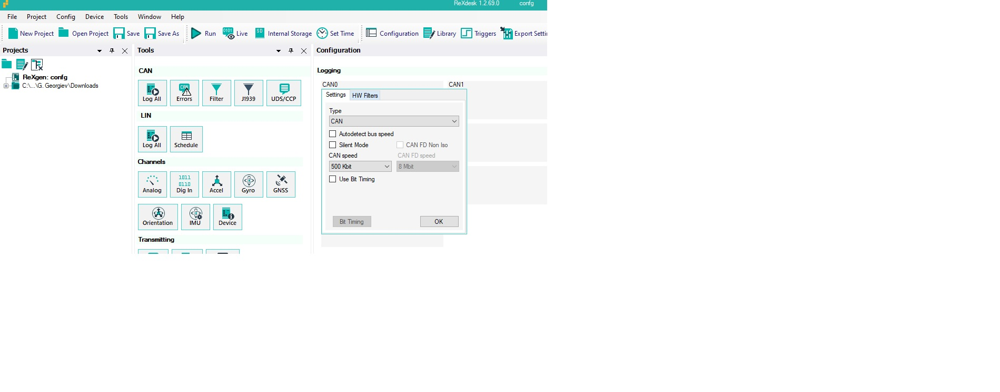
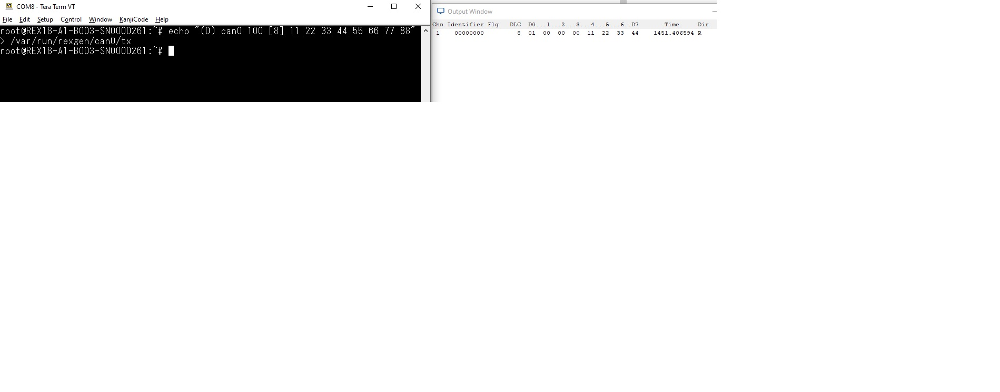
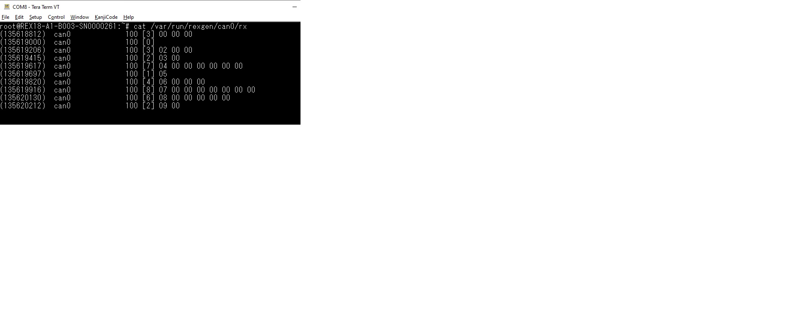
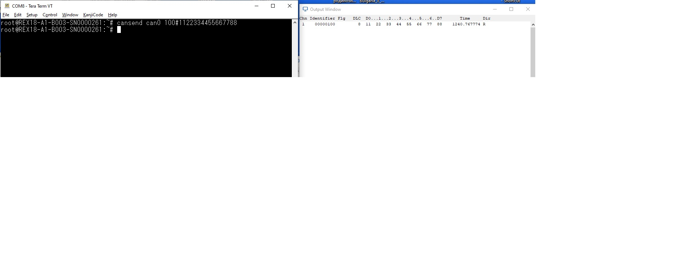
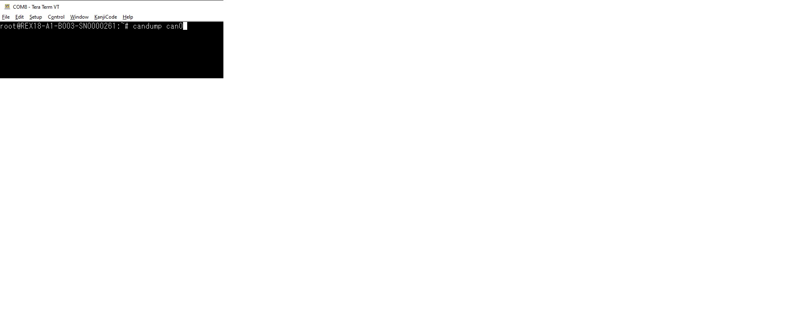

# Example: CAN Round-Trip

Rexgen Smart exposes CAN two ways from Linux userspace: the Rexgen named-pipe interface (`/var/run/rexgen/can0/...`) and standard Linux SocketCAN (`can0` network interface, `can-utils`). Both talk to the same physical bus and can be mixed — a frame sent one way shows up received the other way.

## Configuring The CAN Bus With RexDesk

Before sending/receiving on `can0`, the bus must be configured (bus speed, mode) from RexDesk's `Configuration` → `CAN0` → `Settings` panel:



Relevant fields:

- **Type**: `CAN` (vs. CAN FD)
- **CAN speed**: e.g. `500 Kbit` — must match the rest of the bus
- **Autodetect bus speed** / **Silent Mode** / **CAN FD Non Iso**: leave unchecked for a normal active CAN 2.0 bus
- **Bit Timing**: advanced manual timing, only needed for non-standard bit rates

## Method 1: Rexgen Named Pipe

**Send** a frame by writing to `/var/run/rexgen/can0/tx` in the form `(<bus flags>) <interface> <id> [<dlc>] <data bytes>`:

```text
root@REX18-A1-B003-SN0000261:~# echo "(0) can0 100 [8] 11 22 33 44 55 66 77 88" > /var/run/rexgen/can0/tx
```



**Receive** by reading `/var/run/rexgen/can0/rx`:

```text
root@REX18-A1-B003-SN0000261:~# cat /var/run/rexgen/can0/rx
(135618812)  can0          100 [3] 00 00 00
(135619000)  can0          100 [0]
(135619206)  can0          100 [3] 02 00 00
(135619415)  can0          100 [2] 03 00
(135619617)  can0          100 [7] 04 00 00 00 00 00
(135619697)  can0          100 [1] 05
(135619820)  can0          100 [4] 06 00 00
(135619916)  can0          100 [8] 07 00 00 00 00 00 00
(135620130)  can0          100 [6] 08 00 00 00 00
(135620212)  can0          100 [2] 09 00
```



## Method 2: Standard SocketCAN

Because `can0` is also a normal Linux CAN network interface, the standard `can-utils` tools work directly — no Rexgen-specific tooling needed.

**Send** with `cansend`:

```text
root@REX18-A1-B003-SN0000261:~# cansend can0 100#1122334455667788
```



**Receive** with `candump`:

```text
root@REX18-A1-B003-SN0000261:~# candump can0
  can0  100   [8]  11 22 33 44 55 66 77 88
```



## Notes

- The pipe interface and SocketCAN are two views of the same bus traffic — a `cansend` on `can0` is visible both via `candump can0` and via `cat /var/run/rexgen/can0/rx`, and vice versa.
- `can0`–`can3` are configured independently in RexDesk; the pipe paths follow the same numbering (`/var/run/rexgen/can1/rx`, etc.) for the other buses.
- For scripted/application use, prefer standard SocketCAN (`libsocketcan`, `python-can`, raw `AF_CAN` sockets) — it's the documented, portable Linux interface. The Rexgen pipe is useful for quick shell-level testing and for tooling that already speaks the Rexgen pipe protocol (e.g. RexDesk itself).
