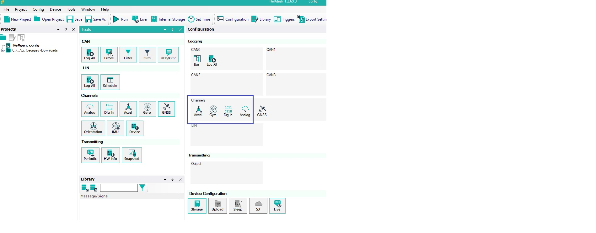
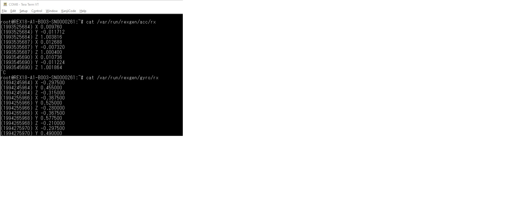
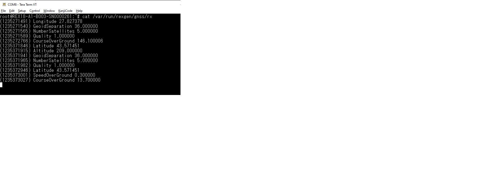
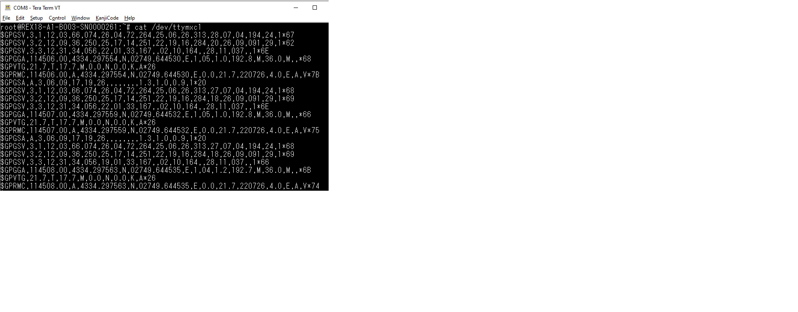

# RexGEN smart — Named-Pipe Interface

Reference and examples for reading and writing RexGEN smart bus/sensor data
through the `rexgend` **named pipes (FIFOs)**.

- [1. What it is](#1-what-it-is)
- [2. Why use it](#2-why-use-it)
- [3. Where the pipes live](#3-where-the-pipes-live)
- [4. When the pipes are created](#4-when-the-pipes-are-created)
- [5. Access model & behaviour](#5-access-model--behaviour)
- [6. CAN — receive (`canN/rx`)](#6-can--receive-cannrx)
- [7. CAN — errors (`canN/err`)](#7-can--errors-cannerr)
- [8. CAN — transmit (`canN/tx`)](#8-can--transmit-canntx)
- [9. Sensors (`gnss`, `dig`, `acc`, `gyro`, `adc`)](#9-sensors-gnss-dig-acc-gyro-adc)
- [10. GNSS channel specification](#10-gnss-channel-specification)
- [11. Examples in this folder](#11-examples-in-this-folder)
- [12. Notes, limits, FAQ](#12-notes-limits-faq)

---

## 1. What it is

`rexgend` receives live data from the RexGEN smart logger over USB and republishes
it, per channel, as **text lines** on Unix **named pipes (FIFOs)** rooted at
`/var/run/rexgen/`. CAN buses are bidirectional (you can also transmit by writing
to a pipe); sensors are receive-only.

No library, protocol stack, or special permissions beyond filesystem access are
needed — a pipe is opened and read/written like an ordinary file.

## 2. Why use it

- **Human-readable.** Every line is plain ASCII; `cat`, `grep`, `awk`, shell,
  Python, etc. work directly.
- **Zero dependencies.** No SocketCAN headers, no CAN tooling — just `open()`/`read()`.
- **Scripting & logging.** Trivial to tee to a file, filter, or forward.
- **Always available.** The CAN pipes exist whenever CAN channels are configured,
  independently of the SocketCAN setting (see the SocketCAN doc for the vcan path,
  which is the better choice for binary throughput and standard CAN tools).

## 3. Where the pipes live

Root directory: **`/var/run/rexgen`**.

| Channel        | RX path                       | TX path                | ERR path                | Type            |
|----------------|-------------------------------|------------------------|-------------------------|-----------------|
| CAN 0–3        | `/var/run/rexgen/canN/rx`     | `/var/run/rexgen/canN/tx` | `/var/run/rexgen/canN/err` | RX + TX + errors |
| GNSS           | `/var/run/rexgen/gnss/rx`     | —                      | —                       | RX only         |
| Accelerometer  | `/var/run/rexgen/acc/rx`      | —                      | —                       | RX only         |
| Gyroscope      | `/var/run/rexgen/gyro/rx`     | —                      | —                       | RX only         |
| Digital (GPIO) | `/var/run/rexgen/dig/rx`      | —                      | —                       | RX only         |
| ADC            | `/var/run/rexgen/adc/rx`      | —                      | —                       | RX only         |
| System         | `/var/run/rexgen/sys`         | —                      | —                       | RX only (single FIFO) |

Where `N` is `0`, `1`, `2`, `3`. `sys` is a single FIFO (no subdirectory).

**Permissions:** channel directories `0755`; RX and ERR FIFOs `0755`; TX FIFOs
`0777` (world-writable so any process can transmit). In practice run as `root`.

## 4. When the pipes are created

A pipe is created only if the corresponding channel exists in the **loaded logger
configuration** (has a non-zero UID). Created on service start / config reload:

- `canN/rx` — if CAN bus *N* has a receive UID.
- `canN/tx` — if CAN bus *N* has a transmit UID.
- `canN/err` — if CAN bus *N* has an error UID.
- `gnss/rx` — if any GNSS channel is configured.
- `acc/rx`, `gyro/rx`, `adc/rx` — if any axis/channel is configured.
- `dig/rx` — if a digital input is configured.
- `sys` — always.

If your program `open()`s a path that does not exist, the channel is simply not
in the current configuration.

## 5. Access model & behaviour

- **Opening for read blocks** until a writer (rexgend) is present — expected FIFO
  semantics. Once open, `read()`/`getline()` deliver whole text lines.
- **Writers are non-blocking** on the daemon side: rexgend opens each RX pipe
  `O_WRONLY | O_NONBLOCK`. If no reader is attached, samples for that channel are
  dropped (not buffered). Attach your reader before you expect data.
- **One line = one record.** Lines are newline-terminated; a single `read` from
  rexgend may batch several frames as consecutive lines.
- **Multiple frames per USB burst** are written as several lines back-to-back.
- Timestamps are the device timestamp in **milliseconds** (32-bit, wraps).

---

## 6. CAN — receive (`canN/rx`)

### Line format
```
(timestamp)  name  [flags]  ID  [dlc] b0 b1 ... bN
```

| Field         | Spec                                                                        |
|---------------|-----------------------------------------------------------------------------|
| `timestamp`   | Device time, milliseconds, unsigned 32-bit, in parentheses.                 |
| `name`        | Bus name: `can0`..`can3`.                                                   |
| `[flags]`     | Frame type. `    ` (4 spaces) = **classic CAN**; `[F]` = **CAN FD**, no BRS; `[FB]` = **CAN FD + BRS**. |
| `ID`          | **Standard**: 3 hex digits, right-aligned (e.g. `153`). **Extended**: 8 hex digits (e.g. `12345678`). Width distinguishes the two. |
| `[dlc]`       | Data length (0–8 classic, up to 64 FD), in brackets.                        |
| `b0..bN`      | `dlc` data bytes, uppercase hex, space-separated.                           |

### Examples
```
(1699999999)  can0       153  [8] AB CD EF 00 01 02 03 04     # classic, standard ID 0x153
(1699999999)  can0  [FB]  12345678  [12] FF EE DD CC BB AA 11 22 33 44 55 66  # FD+BRS, extended
```

### Underlying binary record (for reference)
rexgend formats these from an internal record; the on-wire USB record is:
```c
typedef struct { uint16_t uid; uint8_t infSize; uint8_t dlc; } RecHeader;      // infSize = 9 for CAN
typedef struct {
    RecHeader header;
    uint32_t  timestamp;   // ms
    uint32_t  canID;
    uint8_t   flags;       // bit0 = IDE (extended), bit2 = FD (EDL), bit3 = BRS
} CanDataFrame;            // followed by `dlc` data bytes
```
You never parse this binary form on the pipe — it is already rendered to text.

---

## 7. CAN — errors (`canN/err`)

### Line format
```
(timestamp)  name        <Error Name>  Code: <c> Count: <n> [dlc]
```

| Code | Error Name            |
|------|-----------------------|
| 1    | `Bit Error`           |
| 2    | `Form Error`          |
| 3    | `Bit Stuffing Error`  |
| 4    | `CRC Error`           |
| 5    | `Acknowledgment Error`|
| other| `Unknown Error`       |

`Count` is the controller's error counter for that type.

### Example
```
(1699999999)  can0        CRC Error  Code: 4 Count: 3 [8]
```

---

## 8. CAN — transmit (`canN/tx`)

Write **one text line per frame** to `/var/run/rexgen/canN/tx`. The frame is
queued and sent by the device.

### Line format
```
<timestamp> canN [flags] <ID_hex> <dlc> b0 b1 ... bN
```

| Token         | Spec                                                                                         |
|---------------|----------------------------------------------------------------------------------------------|
| `<timestamp>` | Required leading integer, **ignored** — the daemon stamps the frame itself. Use `0`.         |
| `canN`        | Must start with `can`; only the numeric suffix is validated. The **actual bus is chosen by which `tx` pipe you write to**, not by this token. |
| `[flags]`     | Optional. `[F]` = CAN FD (no BRS); `[FB]` = CAN FD + BRS. Omit for classic CAN.               |
| `<ID_hex>`    | CAN identifier in hex. **1–3 hex digits ⇒ standard ID; 4+ ⇒ extended ID.**                    |
| `<dlc>`       | Number of data bytes. May be written `8` or `[8]` (brackets are ignored).                     |
| `b0..bN`      | `dlc` data bytes in hex.                                                                       |

The parser tokenizes on spaces/parentheses/brackets, requires **at least 4
tokens** (timestamp, bus, id, dlc), and checks `token_count == 4 + dlc (+1 if flags)`.

### Examples
```
0 can0 153 8 AA BB CC DD EE FF 00 11                          # classic, standard ID 0x153
0 can0 1ABCDEF0 4 DE AD BE EF                                 # classic, extended ID
0 can0 [FB] 12345678 12 00 01 02 03 04 05 06 07 08 09 0A 0B    # CAN FD + BRS, extended, 12 bytes
```

### Compatibility with the RX format
The RX line format is accepted by the TX parser (the `canN` name is stripped to
its number, `[dlc]` brackets are ignored), so frames can be forwarded verbatim:
```sh
cat /var/run/rexgen/can0/rx > /var/run/rexgen/can1/tx   # bridge can0 -> can1
```

---

## 9. Sensors (`gnss`, `dig`, `acc`, `gyro`, `adc`)

All sensor pipes share one line format:
```
(timestamp) <channel> <value>
```
| Pipe   | `<value>` type | Meaning                                   |
|--------|----------------|-------------------------------------------|
| `dig`  | integer (0/1)  | Digital input line state (GPIO), **read-only** |
| `acc`  | float          | Accelerometer axis                        |
| `gyro` | float          | Gyroscope axis                            |
| `adc`  | float          | Analog input                              |
| `gnss` | see §10        | GNSS/GPS channel                          |

`<channel>` is the channel's name string (e.g. digital `0`..`3`, GNSS
`Latitude`).

Examples:
```
(1699999999) 0 1                 # digital input 0 = high
(1699999999) X 9.810000          # accelerometer X axis
(1699999999) Latitude 43.572205  # GNSS latitude
```

> **GPIO is read-only.** There is no digital-output pipe; outputs are driven by
> the logger configuration, not from user-space.

---

## 10. GNSS channel specification

`gnss/rx` emits one line per updated channel. Value type depends on the channel:

| Channel              | Type    | Units / meaning                    |
|----------------------|---------|------------------------------------|
| `Latitude`           | double  | decimal degrees                    |
| `Longitude`          | double  | decimal degrees                    |
| `Altitude`           | float   | metres                             |
| `Datetime`           | uint32  | Unix epoch seconds, UTC            |
| `SpeedOverGround`    | float   |                                    |
| `GroundDistance`     | float   |                                    |
| `CourseOverGround`   | float   | degrees                            |
| `GeoidSeparation`    | float   | metres                             |
| `NumberSatellites`   | float   | count                              |
| `Quality`            | float   | fix quality                        |
| `HorizontalAccuracy` | float   |                                    |
| `VerticalAccuracy`   | float   |                                    |
| `SpeedAccuracy`      | float   |                                    |

Parsing tip: reading the value with `%lf` (double) works for the float channels
too; only `Datetime` is a whole number you may prefer to read as an integer.

---

## 11. Examples in this folder

Same four tasks in **Bash**, **Python**, and **Node.js**:

```
bash/     can_read.sh   can_send.sh   gnss_read.sh   gpio_read.sh
python/   can_read.py   can_send.py   gnss_read.py   gpio_read.py
nodejs/   can_read.js   can_send.js   gnss_read.js   gpio_read.js
```

| Task      | Does                                                                |
|-----------|--------------------------------------------------------------------|
| `can_read`| Streams `canN/rx`; the Python/Node versions also parse the fields. |
| `can_send`| Writes one frame line to `canN/tx` (default `0x153`, 8 bytes).     |
| `gnss_read`| Parses `gnss/rx` into `(timestamp, channel, value)`.             |
| `gpio_read`| Parses `dig/rx` line states (reusable for acc/gyro/adc).         |

Run as root on the device:
```sh
sh     bash/can_read.sh    can0
python3 python/can_read.py can0
node   nodejs/can_read.js  can0
```

The Bash examples are just thin wrappers — the raw shell equivalents are:
```sh
cat  /var/run/rexgen/can0/rx                                            # watch CAN
echo "0 can0 153 8 AA BB CC DD EE FF 00 11" > /var/run/rexgen/can0/tx   # send a frame
cat  /var/run/rexgen/gnss/rx                                            # watch GNSS
cat  /var/run/rexgen/dig/rx                                             # watch digital inputs
```
No build step — all three languages read/write these pipes as plain files.

## 12. Notes, limits, FAQ

- **Nothing appears?** The channel may not be in the loaded config (pipe absent),
  or no reader was attached before data arrived (RX writes are non-blocking and
  dropped without a reader).
- **One reader per pipe** is the intended model; multiple readers on one FIFO
  split the byte stream and will corrupt line framing.
- **Line batching:** a single `read()` may return several lines; always parse
  line by line (`getline`).
- **Throughput:** for high-rate CAN, the SocketCAN (vcan) path is more efficient
  and integrates with `candump`/`cansend` — see `../socketcan/`.
- **Transmit result:** writing to `canN/tx` queues the frame; there is no
  per-frame ACK on the pipe.

---

## 13. Verified On Real Hardware

Captured on a `REX18-A1-B003` unit over serial console, before the format/config
details above were documented — kept here as independent confirmation that the
pipes behave as specified.

Enabling channels (Accel/Gyro/Analog/Digital/GNSS) so their pipes produce data
is done from RexDesk's `Configuration` → `Channels` panel:



**Accelerometer / Gyroscope** (`acc/rx`, `gyro/rx` — values in g and deg/s):

```text
root@REX18-A1-B003-SN0000261:~# cat /var/run/rexgen/acc/rx
(1993525684) X 0.009760
(1993525684) Y -0.011712
(1993525684) Z 1.003816

root@REX18-A1-B003-SN0000261:~# cat /var/run/rexgen/gyro/rx
(1994245964) X -0.297500
(1994245964) Y 0.455000
(1994245964) Z -0.315000
```



**Analog / Digital channels** (`adc/rx`, `dig/rx`):

```text
root@REX18-A1-B003-SN0000261:~# cat /var/run/rexgen/adc/rx
(2004153740) 3 12.123950
(2004156306) 0 0.047500

root@REX18-A1-B003-SN0000261:~# cat /var/run/rexgen/dig/rx
(2004895024) 2 1
(2004896042) 3 1
```


**GNSS** — init the receiver once per boot, then read the parsed pipe or the raw NMEA UART:

```text
root@REX18-A1-B003-SN0000261:~# /opt/influx/gnssdata_start.sh

root@REX18-A1-B003-SN0000261:~# cat /var/run/rexgen/gnss/rx
(1235371846) Latitude 43.571451
(1235371915) Altitude 209.000000
(1235373001) SpeedOverGround 0.300000
(1235373027) CourseOverGround 13.700000
```



```text
root@REX18-A1-B003-SN0000261:~# cat /dev/ttymxc1
$GPGGA,114506.00,4334.297554,N,02749.644530,E,1,05,1.0,192.8,M,36.0,M,,*68
$GPRMC,114506.00,A,4334.297554,N,02749.644530,E,0.0,21.7,220726,4.0,E,A,V*7B
```



`/dev/ttymxc1` is the raw NMEA 0183 serial device on this board revision — confirm the exact device node for other revisions.
